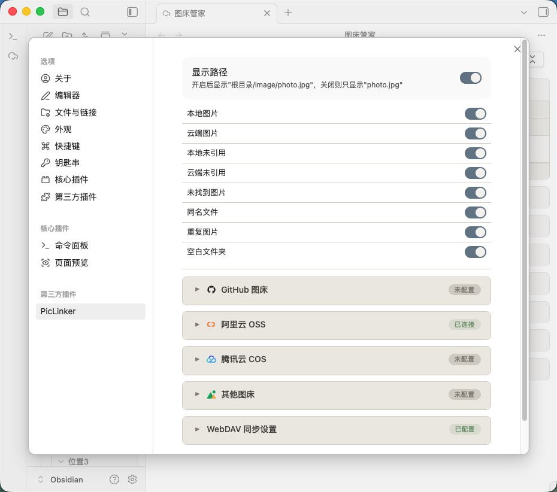

# PicLinker

An Obsidian plugin for managing image assets across your vault — scanning, deduplication, comparison, and batch operations.

[](https://github.com/Coeris/PicLinker/releases)
[](https://github.com/Coeris/PicLinker/releases)
[](LICENSE)
[](https://github.com/Coeris/PicLinker/stargazers)

> 🧭 **文档导航：** [中文说明](README.zh.md) · **English** · [配置指南](CONFIG.md) · [开发指南](DEVELOPMENT.md) · [变更日志](CHANGELOG.md) · [安全](SECURITY.md) · [贡献](CONTRIBUTING.md)

**Main panel: eight-panel overview**


## Install

**Community plugin store (recommended)**

Open Obsidian → Settings → Community plugins → Browse → search "PicLinker" → Install → Enable.

**Manual install**

Download `main.js`, `manifest.json`, and `styles.css` from [Releases](https://github.com/Coeris/PicLinker/releases), place them in `.obsidian/plugins/PicLinker/`, and enable the plugin.

## Core features

- **Vault-wide scanning with real-time response** — recognizes three image reference formats (skipping code blocks): ``, `![[path]]`, ``. Incremental scanning (mtime cache, concurrency 20) speeds up large vaults. Six events are registered (create / modify / delete / rename, metadataCache resolution, active-leaf switching) with 500 ms debounce for real-time accuracy.
- **Eight-panel view** — separate views for referenced vs. unreferenced images, missing links, same-name files, duplicates, and empty folders, each independently collapsible with search filtering and counts.
- **Four image hosts** — Aliyun OSS (V4 signature), Tencent COS (V1 signature), GitHub, and SM.MS, cross-checked against actual references, with frontmatter path prefixes and bare-path image fields (cover / banner, etc.) auto-detected.
- **Smart deduplication** — SHA-256 content hashing across local×local, cloud×cloud, and local×cloud. Dedup is not automatic during scanning: trigger it via the toolbar "Dedup" button (single-click for selected, double-click for the whole vault). The keeper is the highest-scored unselected item (cloud +1000 weight). After deletion, all note references are updated automatically — zero broken links.
- **Batch operations** — batch delete (trash-recoverable), delete cloud files, delete reference lines (tag-level), copy Markdown/HTML links, download. A confirmation modal shows the affected count and asks once before executing.
- **Security** — AES-GCM + PBKDF2 encrypted credential storage (v1→v2 auto-migration); desktop uses the Node.js request layer and mobile falls back to `requestUrl`, both bypassing CORS.
- **WebDAV sync** — share image-host configs across devices with three-way conflict detection (local mtime / remote mtime / last sync time); supports Nutstore (坚果云) and NextCloud.
- **Mobile support** — single-finger drag to pan, pinch to zoom, tap overlay to close; thumbnail sizes auto-tighten (28×28); toolbar and action area stack at 768 px, settings stack at 600 px; notch safe-area adapted.

## Eight-panel view

| Panel | Description |
|-------|-------------|
| Local images | Files present in the vault and referenced by notes |
| Cloud images | Hosted on an image host and referenced by notes |
| Local unreferenced | Present in the vault, no note references |
| Cloud unreferenced | Hosted but not referenced by any note |
| Missing images | Referenced by notes but absent both locally and in the cloud (broken links); grouped by referencing note since 1.3.0 |
| Same-name files | Local and cloud files sharing a filename, or multiple local files with the same name |
| Duplicate images | File groups with identical SHA-256 hashes |
| Empty folders | Directories containing no files or subfolders |

Source badges: same-name and duplicate entries are prefixed with a purple "Local" or blue "Cloud" badge.

## Configuration

See **[`CONFIG.md`](CONFIG.md)** for detailed image-host setup (GitHub / Aliyun OSS / Tencent COS / SM.MS), WebDAV sync, and general settings.

**Settings panel**



## Supported image syntax

```markdown
              <!-- Standard Markdown -->
![[image.png|500]]          <!-- Wikilink with size (wikilink-only; Markdown  does not support `|size`) -->
![[image.png]]              <!-- Wikilink -->
       <!-- HTML -->
```

Remote URLs are recognized too. Code blocks are skipped automatically.

### Frontmatter

```yaml
---
image-bed: aliyun       # image host (GitHub / aliyun / tencent / other)
image-path: blog/2026/  # cloud path prefix
---
```

Beyond `image-bed` / `image-path` config keys, top-level bare-path image fields (such as `cover`, `banner`, `thumbnail`, whose value ends with an image extension) are auto-detected and included in reference stats and dedup comparison. Config keys are excluded from scan results.

## Commands

| Command | Description |
|---------|-------------|
| `打开图床管家` (Open PicLinker) | Open the main view |
| `刷新图片扫描` (Refresh image scan) | Rescan the whole vault |
| `运行诊断测试` (Run diagnostics) | Run functional diagnostics |

## Development

See **[`DEVELOPMENT.md`](DEVELOPMENT.md)** for the project structure, build setup, and contribution guide.

## License

[MIT](LICENSE) © PicLinker
