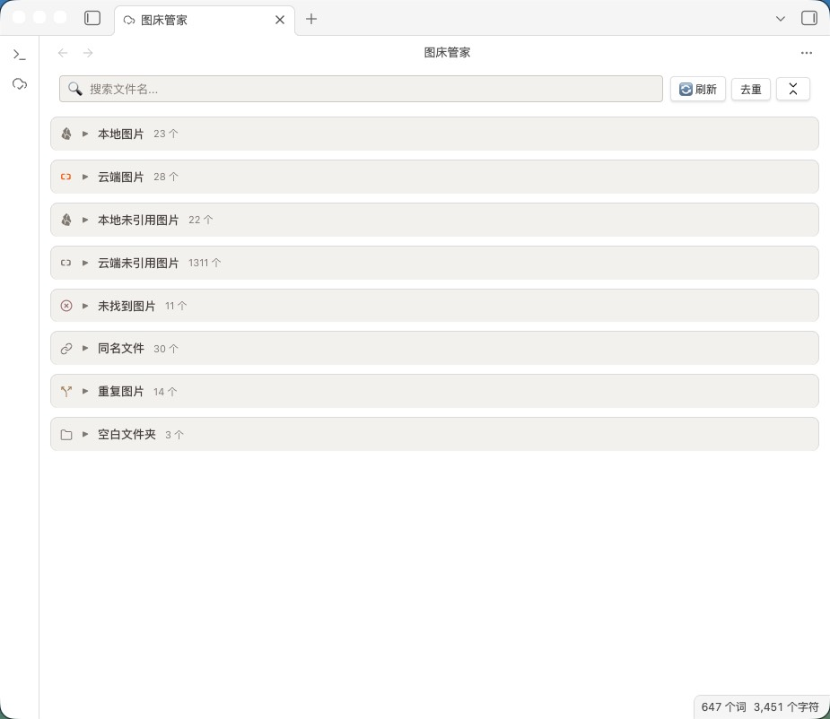

# PicLinker

An Obsidian plugin for managing image assets across your vault — scanning, deduplication, comparison, and batch operations.

## Install

**Manual install (recommended)**

Download `main.js`, `manifest.json`, and `styles.css` from [Releases](https://github.com/Coeris/PicLinker/releases), place them in `.obsidian/plugins/PicLinker/`, and enable the plugin.

> ⚠️ Submission to the community plugin store is in review; until it is listed, please use manual install.

- [中文说明](README.zh.md)
- [Configuration guide](CONFIG.md)
- [Development guide](DEVELOPMENT.md)

**插件总览**

