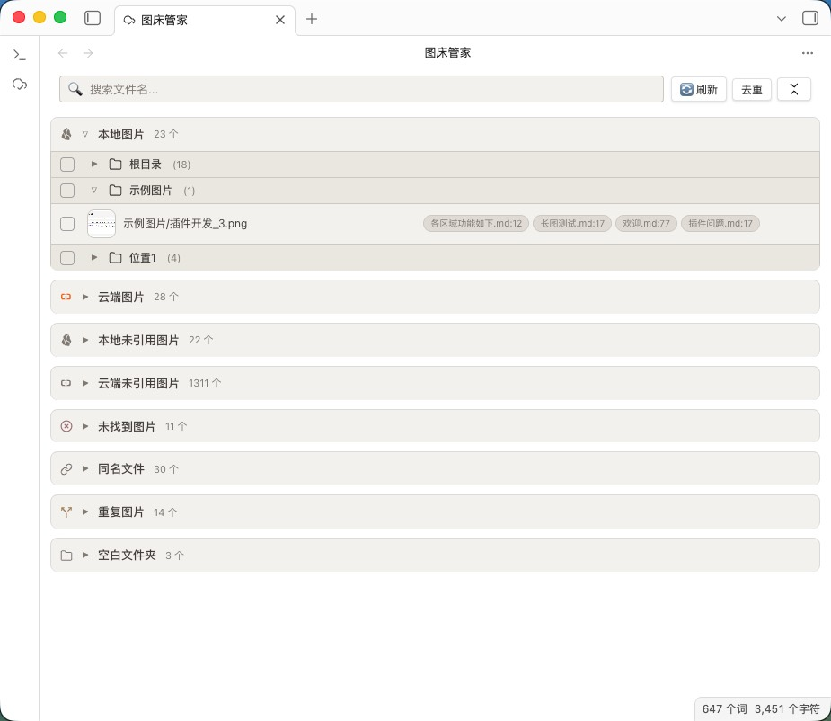
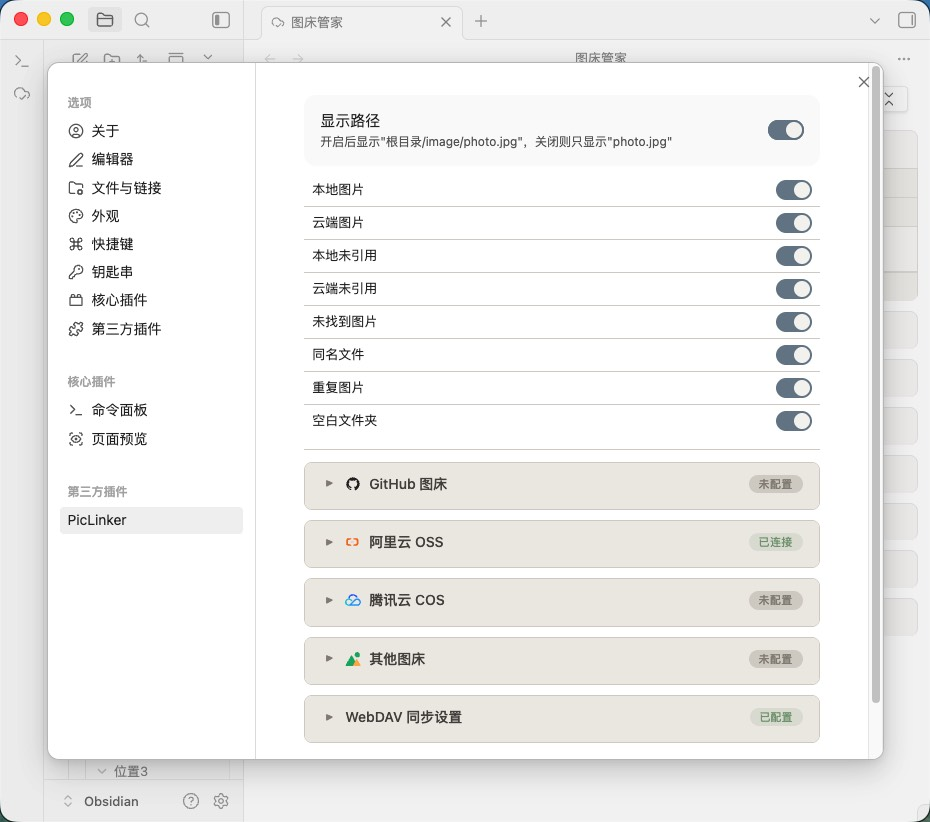

# PicLinker — 图床管家

> 🧭 **文档导航：** **中文说明** · [English](README.md) · [配置指南](CONFIG.md) · [开发指南](DEVELOPMENT.md)

一款面向 Obsidian 的全库图片资产管理插件，覆盖扫描、去重、比对与批量操作等核心能力。

**主面板：八区总览**


## 快速开始

**社区插件市场（推荐）**

打开 Obsidian「设置 → 第三方插件 → 浏览」，搜索 **PicLinker**，点击安装并启用即可。

**手动安装**

前往 [Releases](https://github.com/Coeris/PicLinker/releases) 下载 `main.js` + `manifest.json` + `styles.css`，放入 vault 的 `.obsidian/plugins/PicLinker/` 目录，重启启用即可。

## 核心功能

**展开视图：目录树与引用标签**



### 🔍 全库扫描与实时响应

自动识别三种图片引用格式（跳过代码块）：``、`![[path]]`、``。增量扫描（mtime 缓存，并发 20）加速大库启动，vault 五事件监听 + 500ms 防抖保证实时性。

### 📊 八区视图

| 区域 | 说明 |
|------|------|
| 本地图片 | 库内有文件、被笔记引用 |
| 云端图片 | 图床中、被笔记引用 |
| 本地未引用 | 库内存在、无笔记引用 |
| 云端未引用 | 图床存在、无笔记引用 |
| 断链 | 笔记引用但本地+云端均不存在 |
| 同名文件 | 本地与云端同名文件 |
| 重复图片 | SHA-256 哈希相同的文件组 |
| 空白文件夹 | 不含图片的目录 |

每区独立折叠，支持搜索过滤和数量统计。

### 🌐 四图床接入

支持阿里云 OSS（V4 签名）、腾讯云 COS（V1 签名）、GitHub、SM.MS 四种图床。云端文件列表与实际引用交叉比对，自动识别 frontmatter 路径前缀与裸路径图片字段（cover / banner 等）。

### 🔬 智能去重

SHA-256 内容哈希比对，覆盖本地×本地、云端×云端、本地×云端三种模式。去重不会在扫描时自动进行：点击工具栏「去重」按钮触发（单击仅对选中图片、双击全库），云端优先保留，删除后自动更新全部笔记引用，零断链。

### 🧹 批量操作

批量删除（回收站可恢复）、删除云端文件、删除引用行（标签级）、复制 Markdown/HTML 链接、下载。删除前弹窗列出受影响笔记，逐文件确认。

### 🔒 安全

AES-GCM + PBKDF2 加密凭据存储（v1→v2 自动迁移）；directFetch 桌面端走 Node.js 请求层、移动端回退 `requestUrl`，均不受 CORS 限制。

### 🔄 WebDAV 同步

多设备共享图床配置。三方冲突检测（本地 mtime / 远程 mtime / 上次同步时间），支持坚果云、NextCloud。

### 🖼 交互细节

- 缩略图点击预览，滚轮缩放 ×0.1～×10，双击重置
- 双击条目跳转笔记并定位行
- 目录树复选框递归同步 + indeterminate 半选状态

### 🎨 外观与主题

采用莫兰迪低饱和配色，自动跟随 Obsidian 浅色 / 深色主题切换。顶端工具栏融入页面背景、无悬浮条观感；设置页原生开关、输入框、按钮均适配配色（浅色无蓝边、深色无白底），图标与状态色由主题变量驱动。

## 八区视图详解

### 🔍 本地图片

vault 内有实际文件、且被至少一篇笔记引用的图片。

- 缩略图预览 → 点击放大，滚轮缩放
- 双击条目 → 跳转到引用笔记并定位行
- 勾选后 → 复制 Markdown/HTML 链接、下载

### ☁️ 云端图片

已上传图床、被笔记引用。按图床 + 文件夹分组展示。

- **删除云端文件**：从图床删除，笔记引用变断链
- **删除引用行**：只清笔记中的引用行，不删云端文件

### 🗑️ 本地未引用

vault 内存在但无笔记引用的图片。**定期清理可减轻 vault 体积。**

### 🌫️ 云端未引用

图床中存在但无笔记引用的文件。**勾选删除可减少图床存储费用。**

### ⛓️‍💥 断链

笔记引用但本地和云端都不存在的链接。可批量删除断链并清理引用行，或复制列表排查问题。

### 📋 同名文件

本地与云端文件名相同的图片。检查组内差异决定保留本地还是云端。

### 🔬 重复图片

SHA-256 完全相同（不依赖文件名）。去重需手动触发：点击工具栏「去重」按钮（单击仅对选中图片、双击全库扫描）计算重复组，之后一键去重自动保留最佳版本，零断链。

### 📁 空白文件夹

不含任何图片的目录。一键清理。

## 配置

**设置面板：显示选项与图床管理**



详细的图床配置（GitHub / 阿里云 OSS / 腾讯云 COS / SM.MS）、WebDAV 同步及通用设置请参阅 **[`CONFIG.md`](CONFIG.md)**。

## 支持的图片语法

```markdown
              <!-- Markdown 标准 -->
           <!-- 带尺寸参数 -->
![[image.png]]               <!-- Wiki 链接 -->
        <!-- HTML -->
```

远程 URL 也会被识别。插件自动跳过代码块。

### Frontmatter

```yaml
---
image-bed: aliyun       # 图床（GitHub / aliyun / tencent / other）
image-path: blog/2026/  # 云端路径前缀
---
```

除 `image-bed` / `image-path` 等配置键外，位于 frontmatter 顶层的**裸路径图片字段**（如 `cover`、`banner`、`thumbnail`，值为以图片扩展名结尾的本地或远程路径）也会被自动识别，纳入引用统计与去重比对。配置类键不计入扫描结果。

## 命令

| 命令 | 说明 |
|------|------|
| `打开图床管家` | 打开主界面 |
| `刷新图片扫描` | 重新扫描全库 |
| `运行诊断测试` | 运行功能诊断 |

## 开发

请参阅 **[`DEVELOPMENT.md`](DEVELOPMENT.md)**。
