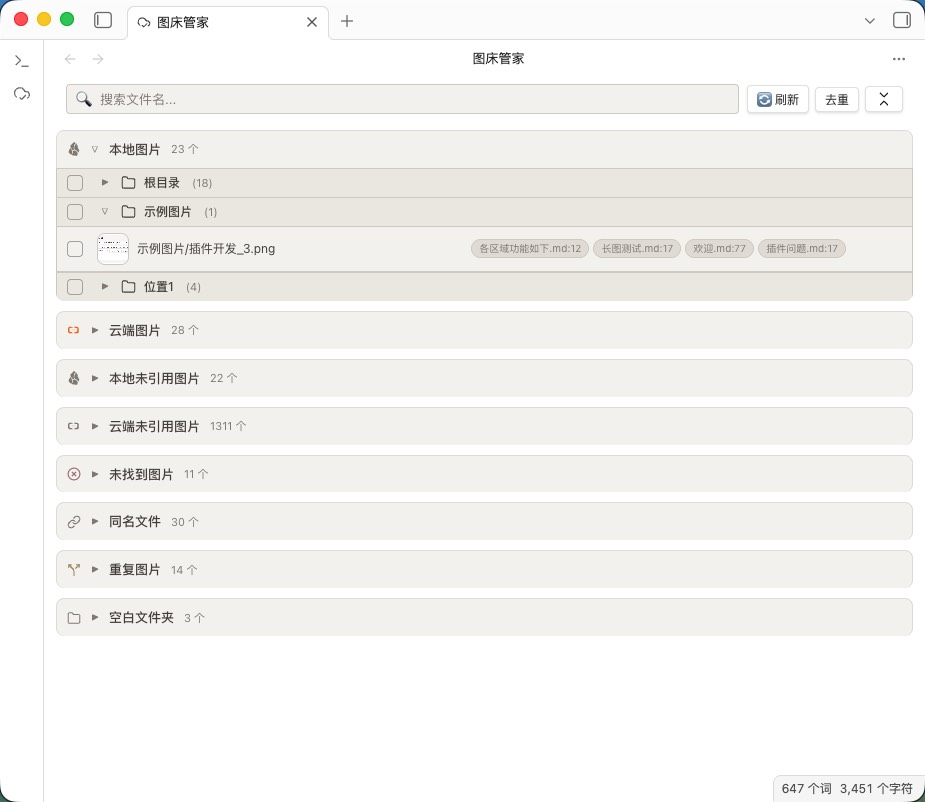
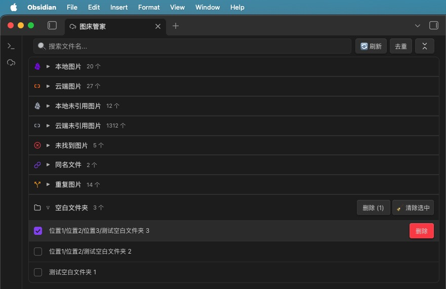

# PicLinker — 图床管家

> 🧭 **文档导航：** **中文说明** · [English](README.md) · [配置指南](CONFIG.md) · [开发指南](DEVELOPMENT.md) · [变更日志](CHANGELOG.md) · [安全](SECURITY.md) · [贡献](CONTRIBUTING.md)

[](https://github.com/Coeris/PicLinker/releases)
[](https://github.com/Coeris/PicLinker/releases)
[](LICENSE)
[](https://github.com/Coeris/PicLinker/stargazers)

一款面向 Obsidian 的全库图片资产管理插件，覆盖扫描、去重、比对与批量操作等核心能力。

**主面板：八区总览**


## 快速开始

**社区插件市场（推荐）**

打开 Obsidian → 设置 → 第三方插件 → 浏览 → 搜索「PicLinker」→ 安装 → 启用。

**手动安装**

前往 [Releases](https://github.com/Coeris/PicLinker/releases) 下载 `main.js` + `manifest.json` + `styles.css`，放入 vault 的 `.obsidian/plugins/PicLinker/` 目录，重启启用即可。

## 核心功能

**展开视图：目录树与引用标签**



### 🔍 全库扫描与实时响应

自动识别三种图片引用格式（跳过代码块）：``、`![[path]]`、``。增量扫描（mtime 缓存，并发 20）加速大库启动，vault 4 个文件事件监听（create/modify/delete/rename）+ metadataCache 解析 + 活动页签切换，共注册 6 个事件，500ms 防抖保证实时性。

### 📊 八区视图

| 区域 | 说明 |
|------|------|
| 本地图片 | 库内有文件、被笔记引用 |
| 云端图片 | 图床中、被笔记引用 |
| 本地未引用 | 库内存在、无笔记引用 |
| 云端未引用 | 图床存在、无笔记引用 |
| 未找到图片 | 笔记引用但本地文件缺失（断链）；云端数据就绪后已上传云端的不计入此区 |
| 同名文件 | 本地与云端同名、或本地多处同名的图片 |
| 重复图片 | SHA-256 哈希相同的文件组 |
| 空白文件夹 | 不含任何文件或子文件夹的目录 |

每区独立折叠，支持搜索过滤和数量统计。

### 🌐 四图床接入

支持阿里云 OSS（V4 签名）、腾讯云 COS（V1 签名）、GitHub、SM.MS 四种图床。云端文件列表与实际引用交叉比对，自动识别 frontmatter 路径前缀与裸路径图片字段（cover / banner 等）。

### 🔬 智能去重

SHA-256 内容哈希比对，覆盖本地×本地、云端×云端、本地×云端三种模式。去重不会在扫描时自动进行：点击工具栏「去重」按钮触发（单击仅对选中图片、双击全库），保留项取未选中项里评分最高者（云端 +1000 权重优先），删除后自动更新全部笔记引用，零失效链接。

### 🧹 批量操作

批量删除（回收站可恢复）、删除云端文件、删除引用行（标签级）、复制 Markdown/HTML 链接、下载。删除前弹窗确认受影响数量，**单次确认**即执行。

### 🔒 安全

AES-GCM + PBKDF2 加密凭据存储（v1→v2 自动迁移）；directFetch 桌面端走 Node.js 请求层、移动端回退 `requestUrl`，均不受 CORS 限制。

### 🔄 WebDAV 同步

多设备共享图床配置。三方冲突检测（本地 mtime / 远程 mtime / 上次同步时间），支持坚果云、NextCloud。

### 🖼 交互细节

- 缩略图点击预览，滚轮缩放 ×0.1～×10，双击重置
- 双击条目跳转笔记并定位行
- 八区（空白文件夹区除外）均支持分组级复选框：组头一键全选/取消，三态 ☐/▣/☑️；本地目录树父子递归同步 + indeterminate 半选状态

### 📱 移动端适配

- 触控：单指拖拽平移、双指 pinch 缩放、单击 overlay 关闭；拖动后浏览器不派发 click，避免误关
- 缩略图尺寸自动收紧（28×28）；工具栏与操作区在 768px 断点纵向堆叠，设置页各设置项在 600px 断点纵向堆叠
- 已适配刘海安全区：顶部工具栏与底部操作区不会被状态栏 / Home 指示条遮挡
- 桌面端 `dblclick` 复制文件名/路径在触屏设备上不生效，需要更精细的移动端体验请在桌面端使用

### 🎨 外观与主题

采用莫兰迪低饱和配色，自动跟随 Obsidian 浅色 / 深色主题切换。顶端工具栏融入页面背景、无悬浮条观感；设置页原生开关、输入框、按钮均适配配色（浅色无蓝边、深色无白底），图标与状态色由主题变量驱动。

## 八区视图详解

### 🔍 本地图片

vault 内有实际文件、且被至少一篇笔记引用的图片。

- 缩略图预览 → 点击放大，滚轮缩放
- 双击条目 → 跳转到引用笔记并定位行
- 勾选后 → 复制 Markdown/HTML 链接、下载（此能力在云端图片区与云端未引用区提供；本地图片区仅有「删除」「清理引用」）

### ☁️ 云端图片

已上传图床、被笔记引用。按图床 + 文件夹分组展示。

- **删除云端文件**：从图床删除，笔记引用**同步清理**，不会出现失效链接
- **删除引用行**：只清笔记中的引用行，不删云端文件

### 🗑️ 本地未引用

vault 内存在但无笔记引用的图片。**定期清理可减轻 vault 体积。**

### 🌫️ 云端未引用

图床中存在但无笔记引用的文件。**勾选删除可减少图床存储费用。**

### ⛓ 未找到图片

笔记引用但本地和云端都不存在的链接（断链）。1.3.0 起按**引用笔记分组**展示：同一张断链图被哪些笔记引用，就拆成几个组，组头显示笔记完整路径与「（X 篇笔记，Y 项内容）」计数。

- 勾选组头复选框 → 全选该笔记下的所有引用行；子项复选框三态同步
- 双击路径文本 → 复制图片完整路径
- 点击行号标签 `L:行号` 或双击整行 → 跳转到对应笔记并定位行
- 单条「删除」按钮 → 确认后仅删除该行引用（不删文件），其他引用不受影响
- 勾选多条 → 工具栏「清理引用 (N)」批量清理选中引用行

### 📋 同名文件

本地与云端文件名相同的图片。检查组内差异决定保留本地还是云端。每条图片前以紫色「本地」/ 蓝色「云端」徽章标识来源，一眼区分本地文件与图床文件。

### 🔬 重复图片

SHA-256 完全相同（不依赖文件名）。去重需手动触发：点击工具栏「去重」按钮（单击仅对选中图片、双击全库扫描）计算重复组，之后一键去重自动保留最佳版本并替换全库引用。本地引用保留 wikilink 格式，云端 URL 自动转为 `` 兼容 Obsidian 渲染。每条重复项前以紫色「本地」/ 蓝色「云端」徽章标识来源。

> 「重复图片」区工具栏的「替换为云端 / 替换为本地」按钮由设置项**一键替换**控制，默认关闭；开启后无需手动勾选即可一键合并重复组。

> 去重结果基于本地哈希缓存计算。点击工具栏「清除缓存」仅清空哈希缓存、不影响已算出的重复组；清除后标题显示「缓存已清，点去重重算」，需再次点击「去重」才会用新缓存重算。

### 📁 空白文件夹

不含任何图片的目录。一键清理。

**空白文件夹区**



## 配置

**设置面板：显示选项与图床管理**


详细的图床配置（GitHub / 阿里云 OSS / 腾讯云 COS / SM.MS）、WebDAV 同步及通用设置请参阅 **[`CONFIG.md`](CONFIG.md)**。

## 支持的图片语法

```markdown
              <!-- Markdown 标准 -->
![[image.png|500]]          <!-- Wiki 链接带尺寸（仅 wikilink 支持 `|尺寸`，Markdown `` 不支持） -->
![[image.png]]              <!-- Wiki 链接 -->
       <!-- HTML -->
```

远程 URL 也会被识别。插件自动跳过代码块。

### Frontmatter

```yaml
---
image-bed: aliyun       # 图床（GitHub / aliyun / tencent / other）
image-path: blog/2026/  # 云端路径前缀
---
```

除 `image-bed` / `image-path` 等配置键外，位于 frontmatter 顶层的**裸路径图片字段**（如 `cover`、`banner`、`thumbnail`，值为以图片扩展名结尾的本地或远程路径）也会被自动识别，纳入引用统计与去重比对。配置类键不计入扫描结果。

## 命令

| 命令 | 说明 |
|------|------|
| `打开图床管家` | 打开主界面 |
| `刷新图片扫描` | 重新扫描全库 |
| `运行诊断测试` | 运行功能诊断 |

## 开发

请参阅 **[`DEVELOPMENT.md`](DEVELOPMENT.md)**。

## 许可证

[MIT](LICENSE) © PicLinker
